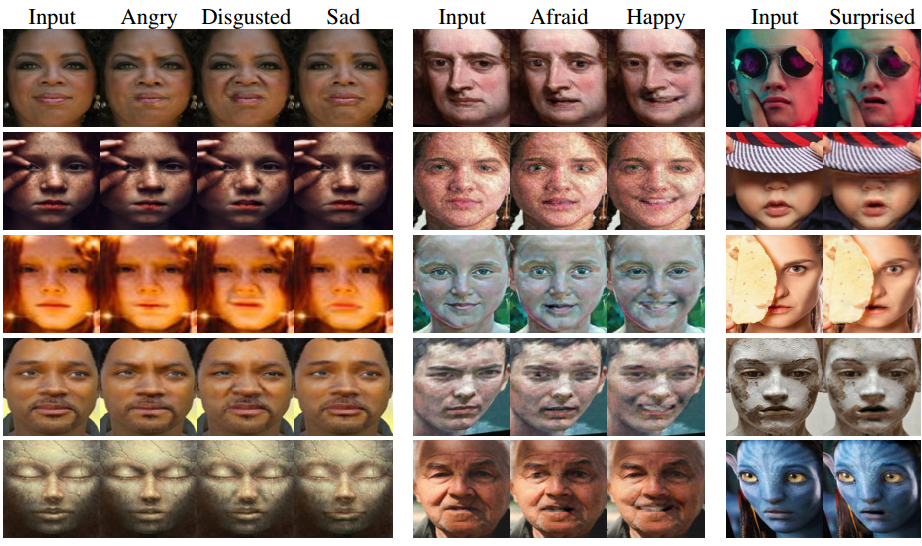

# SARGAN: Spatial Attention-based Residuals for Facial Expression Manipulation

<p align="center"></p>

This repository provides the official implementation of the following paper:
>[SARGAN: Spatial Attention-based Residuals for Facial Expression Manipulation](https://arxiv.org/abs/2303.17212)<br>
> [Arbish Akram](https://arbishakram.github.io/) and [Nazar Khan](http://faculty.pucit.edu.pk/nazarkhan/) <br>
> Department of Computer Science, University of the Punjab, Lahore, Pakistan.<br>
> **Abstract:** *Encoder-decoder based architecture has been widely used in the generator of generative adversarial networks for facial manipulation. However, we observe that the current architecture fails to recover the input image color, rich facial details such as skin color or texture and introduces artifacts as well. In this paper, we present a novel method named SARGAN that addresses the above-mentioned limitations from three perspectives. First, we employed spatial attention-based residual block instead of vanilla residual blocks to properly capture the expression-related features to be changed while keeping the other features unchanged. Second, we exploited a symmetric encoder-decoder network to attend facial features at multiple scales. Third, we proposed to train the complete network with a residual connection which relieves the generator of pressure to generate the input face image thereby producing the desired expression by directly feeding the input image towards the end of the generator. Both qualitative and quantitative experimental results show that our proposed model performs significantly better than state-of-the-art methods. In addition, existing models require much larger datasets for training but their performance degrades on out-of-distribution images. In contrast, SARGAN can be trained on smaller facial expressions datasets, which generalizes well on out-of-distribution images including human photographs, portraits, avatars and statues.*

## Test with Pretrained Model
```
python main.py --test_dataset_dir ./testing_imgs/  --weights_dir ./pre-trained_models/ --model LSRF --image_size 128   \
               --f 1  --mode test_inthewild --results_dir ./results/                               
```

## Train the Model
```
python main.py --train_dataset_dir ./train_dataset/ --weights_dir ./weights/ --model LSRF --image_size 80   \
               --f 9  --beta 60 --mode train --results_dir ./results/                                
```
